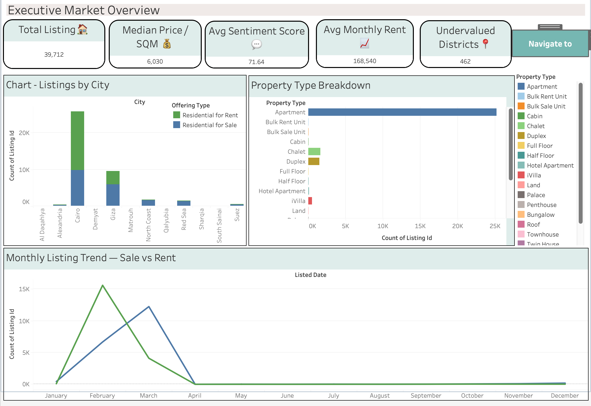
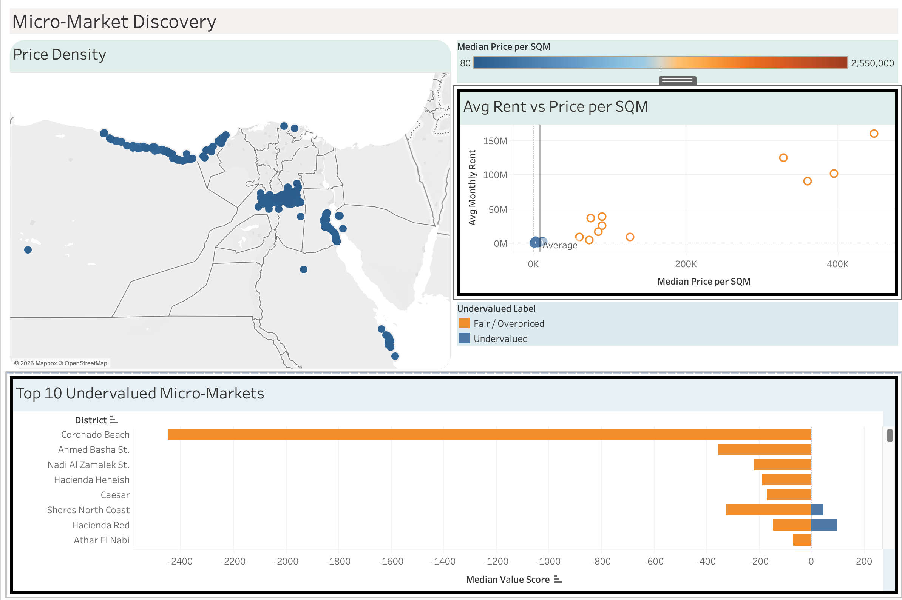
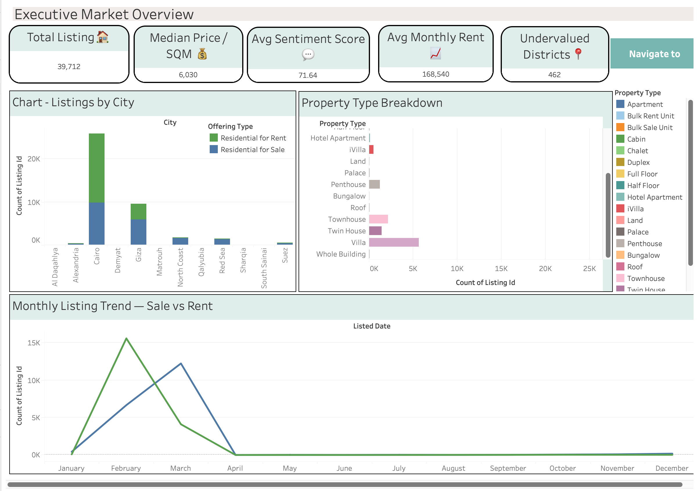

# 🏡 Real Estate Analyzer  
### 🔍 Undervalued Micro-Markets Detection System

<p align="center">
  
  
  
  
</p>

---

## 📌 Overview
A data-driven real estate analytics system designed to identify **undervalued micro-markets** using **statistical analysis and machine learning**.

This project uncovers **hidden investment opportunities** by detecting locations where property prices are inefficient compared to similar listings.

---

## 🚀 Key Highlights
- 📊 End-to-End **ETL Pipeline**
- 📈 Insightful **Exploratory Data Analysis**
- 📉 **Statistical Validation** using hypothesis testing
- 🤖 **Machine Learning Clustering (K-Means)**
- 📍 Location-based **Market Segmentation**
- 💡 Actionable **Investment Insights**

---

## 📊 Dashboard Preview

<p align="center">
  
</p>
<p align="center">
  
</p>
<p align="center">
  
</p>

---

## 🎯 Problem Statement
Identify **undervalued real estate locations** by analyzing property listings and comparing **price per square foot** across similar properties.

---

## 🧠 Methodology

### 1️⃣ Data Pipeline
- Extracted raw listings data  
- Cleaned missing & inconsistent values  
- Standardized formats for analysis  

### 2️⃣ Feature Engineering
- Created key metric:  
  **Price per Sq Ft = Price / Area**

### 3️⃣ Exploratory Analysis
- Price distribution (right-skewed)  
- Correlation analysis (area vs price)  
- Location-based price variation  

### 4️⃣ Statistical Testing
- **Test Used**: Independent Sample T-Test  
- **Insight**: Premium properties are significantly more expensive *(p < 0.05)*  

### 5️⃣ Machine Learning
- Applied **K-Means Clustering**  
- Segmented properties into **4 micro-markets**  
- Identified clusters with **lowest price per sq ft**  

---

## 💡 Key Insights
- 📉 Certain locations are **systematically undervalued**  
- 📍 Strong **geographical price segmentation**  
- 🏢 Premium listings dominate higher price bands  
- 📊 Data-driven approach improves investment decisions  

---

## 🛠️ Tech Stack

| Category          | Tools Used |
|------------------|----------|
| Language         | Python |
| Data Analysis    | Pandas, NumPy |
| Visualization    | Matplotlib, Seaborn |
| Machine Learning | Scikit-learn |
| Dashboard        | Tableau |
| Environment      | Jupyter Notebook |

---

## 📂 Project Structure
```
📦 Egypt-RealEstateAnalyzer/
├── notebooks/
│   ├── 01_extraction.ipynb           # Data Extraction
│   ├── 02_cleaning.ipynb             # Data Cleaning & Preprocessing
│   ├── 03_eda.ipynb                  # Exploratory Data Analysis
│   ├── 04_statistical_analysis.ipynb # Hypothesis Testing
│   └── 05_final_load_prep.ipynb      # Feature Engineering + ML Clustering
├── data/
│   ├── raw/propertyfinder.csv        # raw data from propertyfinder
│   └── processed/cleaned_data.csv    # cleaned data from propertyfinder
├── docs/
│   └── data_dictionary.md            # data dictionary
├── reports/
│   └── project_report.pdf              # project report
└── README.md
```

---

## 🔍 EDA Insights
Key findings from analysis:
- Property prices are **right-skewed** (most properties are affordable, few are expensive).
- Strong **positive correlation** between property area and price.
- Significant price variations exist across different locations.
- Premium listings tend to command higher prices.

---

## 📊 Statistical Validation
- **Hypothesis Tested**: Do premium properties command significantly higher prices?
- **Method**: Independent samples t-test
- **Result**: **P-value < 0.05** — Premium properties are statistically significantly more expensive.

---

## 🤖 Machine Learning

### Technique: **K-Means Clustering**
Used to segment properties into distinct **micro-markets** based on features like price, area, and location.

### Steps:
1. **Feature Engineering**: Created `price_per_sqft`
2. **Feature Scaling**: StandardScaler applied
3. **Clustering**: Grouped properties into 4 micro-markets
4. **Analysis**: Identified clusters with lowest pricing (undervalued markets)

---

## 💡 Investment Insights
- Identified specific micro-markets where price per sq ft is significantly lower
- These markets represent **high-potential investment opportunities**
- Premium vs non-premium analysis shows clear market segmentation
- Data-driven approach enables smarter investment decisions

---

## 🔮 Future Scope
- Real-time API integration for live pricing data
- Rental yield prediction models
- Price appreciation forecasting
- NLP on property descriptions
- Advanced clustering algorithms

---

## 👨‍💻 Author
**Vivek Kumar Raj**
**Rahul Dwivedi**
**Anshvardhan**
**Ansh Sharma**
**Prateek Agade**

---

### 🔗 Useful Links
- [GitHub Repository](https://github.com/viveeeeek13/SectionE_G-5_Egypt-RealEstateAnalyzer)
- [Tableau Public Dashboard](https://public.tableau.com/app/profile/rahul.dwivedi6526/viz/DVACapstoneDashboard/Dashboard1?publish=yes)

---

**Happy Analyzing! 📊**